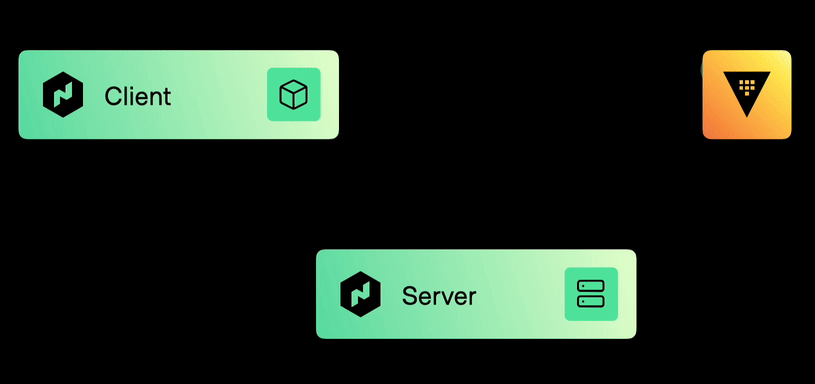
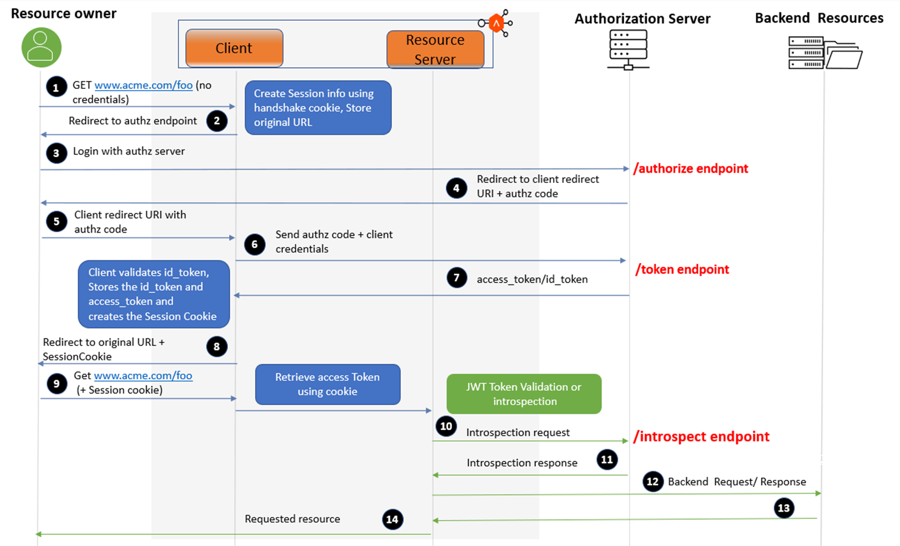

# HashiCorp Nomad <=> Vault Integration: Workload Identity (DETAILED)

## Background
[](https://www.hashicorp.com/blog/nomad-1-7-improves-vault-and-consul-integrations-adds-numa-support)

This example set is based on the following:
- https://gist.github.com/sofixa/17b9a5060851dc1dd95df3426978427e
- https://developer.hashicorp.com/nomad/tutorials/integrate-vault/vault-acl
- https://developer.hashicorp.com/nomad/tutorials/single-sign-on/sso-oidc-vault

This lab excercise will make use of Nomad Server and Client via local machine binaries and Vault in Docker (there will be some Docker Networking foibles to consider)

## Network Connectivity
HashiCorp Vault and OIDC JWKS Endpoint for Nomad Client and Server must be reachable to each other.

##### E.g. [OIDC Connect Protocol](https://openid.net/specs/openid-connect-core-1_0.html#Overview)

The OpenID Connect protocol, in abstract, follows the following steps.

1. The RP (Client) sends a request to the OpenID Provider (OP).
2. The OP authenticates the End-User and obtains authorization.
3. The OP responds with an ID Token and usually an Access Token.
4. The RP can send a request with the Access Token to the UserInfo Endpoint.
5. The UserInfo Endpoint returns Claims about the End-User.

These steps are illustrated in the following diagram:

```shell
+--------+                                   +--------+
|        |                                   |        |
|        |---------(1) AuthN Request-------->|        |
|        |                                   |        |
|        |  +--------+                       |        |
|        |  |        |                       |        |
|        |  |  End-  |<--(2) AuthN & AuthZ-->|        |
|        |  |  User  |                       |        |
|   RP   |  |        |                       |   OP   |
|        |  +--------+                       |        |
|        |                                   |        |
|        |<--------(3) AuthN Response--------|        |
|        |                                   |        |
|        |---------(4) UserInfo Request----->|        |
|        |                                   |        |
|        |<--------(5) UserInfo Response-----|        |
|        |                                   |        |
+--------+                                   +--------+
```

##### E.g. Client - Server - Auth Flow

[](https://avinetworks.com/docs/latest/client-and-resource-server-for-oauth-oidc/)
Diagram Credit: [AVI Networks](https://avinetworks.com/docs/latest/client-and-resource-server-for-oauth-oidc/)

## Prerequisites

- Nomad *`1.7x+`*
  - Nomad ACL Bootstrap Token
- Vault *`1.12+`*
  - `VAULT_ADDR`
  - `VAULT_TOKEN`
  - Token/Auth with appropriate policy to CRUD auth and secrets backends
- Docker
- [pem-jwk](https://www.npmjs.com/package/pem-jwk) (`npm install -g pem-jwk`), manually utilize [jwt.io](https://jwt.io/), or similar tools
- curl
- jq
- npm
- make

## Options
- **JWKS Public Key**: If Nomad OIDC URL is not reachable by Vault or if you would like to trust multiple Nomad Clusters in the same Vault Auth Method / Backend, utilizing the JWKS Public Key is a viable method for these use cases. For more details, reference links and information [**>>HERE<<**](#vault-jwks-public-key-method-for-oidc--jwt-auth)
- **>> [JWKS and OIDC Discovery URLs](https://developer.hashicorp.com/vault/docs/auth/jwt#jwt-verification) <<**: Will be utilizing this method in the excercise.

## Steps:

#### 1. Nomad
###### OIDC JWKS Discovery
When starting the Nomad agents for the Nomad cluster, you'll need to specify the [**Nomad OIDC JWKS Configuration Endpoints**](https://developer.hashicorp.com/nomad/docs/configuration/server#oidc_issuer) (at `../.well-known/openid-configuration` and `../.well-known/jwks.json`) so that it is discoverable by third party IDP/OP platforms (HashiCorp Vault in this case).

The Nomad Agent Configuration parameter `oidc_issuer` is the URL root from which the `../.well-known/*` endpoints can be consumed.

***NOTE***: Networking perspective of the Nomad OIDC Endpoint consumer needs to be accounted for - a few examples:
- **Docker**: If your IDP/Vault is running in Docker, `host.docker.internal` should be utilized from the container.
- **Load-Balancer/GTM/DNS**: that front-ended IP and/or FQDN needs to be accounted for in the `oidc_issuer` configuration)

Example Configurations and Outputs:
- E.g. Nomad OIDC Server Configuration ([jwks-01-00-nomad-server-oidc.hcl](jwks/01-00-nomad-server-oidc.hcl)) - in this case, Nomad is running locally and is exposed on Port `:4646`.
  ```hcl
  server {
  #    oidc_issuer = "http://{{$FQDN}}:{{$PORT}}"
  #    oidc_issuer = "https://{{$FQDN}}:{{$PORT}}"
  #    oidc_issuer = "http://0.0.0.0:4646"
      oidc_issuer = "http://host.docker.internal:4646"
  }
  ```
  This will be supplied to IDP/OP providers looking for the Nomad OIDC configuration endpoint and will be part of the `issuer:` and `jwks_uri:` response values.

###### Start Nomad Agent
- Nomad Agents must be [**configured**](https://developer.hashicorp.com/nomad/docs/integrations/vault#agent-configuration) with [`vault`](https://developer.hashicorp.com/nomad/docs/configuration/vault) blocks.
- Start Nomad (E.g. ```make -f Makefile nomad-init``` or [`./01-01-nomad-init.sh`](jwks/01-01-nomad-init.sh) )
  ```shell
  $ nomad agent -dev \
    -config path/to/nomad/config/01-00-nomad-server-oidc.hcl \
    -bind 0.0.0.0 \
    -network-interface='{{ GetDefaultInterfaces | attr "name" }}' &
  ```

###### Nomad OIDC Endpoint and JWKS Output
Once your Nomad cluster (Server and Client are on the same node in this case), you can examine your OIDC 
- OIDC Endpoint at `{{URL}}/.well-known/openid-configuration`
  ```shell
  $ curl -s http://host.docker.internal:4646/.well-known/openid-configuration | jq
  {
    "id_token_signing_alg_values_supported": [
      "RS256",
      "EdDSA"
    ],
    "issuer": "http://host.docker.internal:4646",
    "jwks_uri": "http://host.docker.internal:4646/.well-known/jwks.json",
    "response_types_supported": [
      "code"
    ],
    "subject_types_supported": [
      "public"
    ]
  }
  ```
- JWKS JSON at `{{URL}}/.well-known/jwks.json`
  ```shell
  $ curl -s http://host.docker.internal:4646/.well-known/jwks.json | jq
  {
    "keys": [
      {
        "use": "sig",
        "kty": "RSA",
        "kid": "110a70ac-76a5-16a7-4ae7-bb0865ecd1a5",
        "alg": "RS256",
        "n": "qxyG-7uLQiCQ1dZSGPd0W-36kA4VtpDHfEbzHyfXJs7Aft2GKVuztLSK4Rye9-ECL1UOjSJ_qNphPdu3vewHB9C1u-B2u0yTpQuXBiDon2pEDvXU4jy0icCrGYEbmzaBJiZoMWhFpDi_bUFl6s7v6HikjIw0t0qiEZBIMYiWGMJC2xOsgtTOsxn4qCK2YYiqHBHMpWGRLceWlpWSt_vxUqmcjJ0xsOaxvz8vD9DvCLMtV5kO6YS4v9wgwZeRmOB2H21ADZMn2ssyRMQUGwF9Qaj0rpfm7cA9_nEaPniaZc2WT9FS-Nch7qOVEhznaT8KANhiei8q4e8wvl4_TRsSvw",
        "e": "AQAB"
      }
    ]
  }
  ```
###### Nomad ACL Bootstrap
Get your token from Nomad ACL Bootstrap activity. See [`./01-03-nomad-acl-bootstrap.sh`](./jwks/01-03-nomad-acl-bootstrap.sh) to bootstrap the Nomad ACL system
- E.g.
  ```shell
  $ nomad acl bootstrap -json
  {
    "ExpirationTTL": "",
    "AccessorID": "83f116d7-ca14-a923-1338-21fe6b86e64a",
    "SecretID": "c4f0403d-6cd0-cb01-4d41-9809e0982f61",
    "Name": "Bootstrap Token",
    "Type": "management",
    "Policies": null,
    "Roles": null,
    "Global": true,
    "CreateTime": "2024-01-11T23:01:50.756625Z",
    "CreateIndex": 12,
    "ModifyIndex": 12
  }
  ```
Copy the value of the `"SecretID"` and set it as the environment variable `NOMAD_TOKEN`.
- E.g.
  ```shell
  $ export NOMAD_TOKEN=Loremips-umdo-lors-itam-etconsectetu 
  ```
  ```shell
  $ source ./jwks/01-03-nomad-acl-bootstrap.env
  ```
- E.g. [`./jwks/01-03-nomad-acl-bootstrap.json`](./jwks/01-03-nomad-acl-bootstrap.env).

#### 2. Vault Configuration for Nomad Workload Identities

###### Enable Vault ACL JWT Auth
- E.g.
  ```shell
  $ vault auth enable -path 'jwt-nomad' 'jwt'
  Success! Enabled jwt auth method at: jwt-nomad/
  ```

  ```shell
  $ vault write auth/jwt-nomad/config -<<EOF
    {
      "jwks_url": "http://0.0.0.0:4646/.well-known/jwks.json",
      "jwt_supported_algs": ["RS256", "EdDSA"],
      "default_role": "nomad-workloads"
    }
  EOF
  Success! Data written to: auth/jwt-nomad/config
  ```
- Terraform: [`./jwks/tf-jwks-url/vault-01-auth-jwt.tf`](./jwks/tf-jwks-url/vault-01-auth-jwt.tf)
###### Create Vault ACL Role
- E.g.
  ```shell
  $ vault write auth/jwt-nomad/role/nomad-workloads -<< EOF
    {
      "role_type": "jwt",
      "bound_audiences": ["vault.io"],
      "user_claim": "/nomad_job_id",
      "user_claim_json_pointer": true,
      "claim_mappings": {
        "nomad_namespace": "nomad_namespace",
        "nomad_job_id": "nomad_job_id",
        "nomad_task": "nomad_task"
      },
      "token_type": "service",
      "token_policies": ["nomad-workloads"],
      "token_period": "30m",
      "token_explicit_max_ttl": 0
    }
  EOF
  Success! Data written to: auth/jwt-nomad/role/nomad-workloads
  ```
- Terraform: [`./jwks/tf-jwks-url/vault-02-auth-jwt-role.tf`](./jwks/tf-jwks-url/vault-02-auth-jwt-role.tf)

###### Create Vault ACL Policy
[Write a policy for Nomad Workload Identity](https://developer.hashicorp.com/nomad/tutorials/integrate-vault/vault-acl#create-a-vault-acl-policy). In the policy example below, `AUTH_METHOD_ACCESSOR` is a placeholder for the actual Vault Auth Accessor for the JWT Auth method - this is an output of `vault auth list` under the `Accessor` column for your auth method (`jwt-nomad` in this case).
```shell
vault auth list
Path          Type     Accessor               Description                            Version
----          ----     --------               -----------                            -------
jwt-nomad/    jwt      auth_jwt_c1ee2d4a      Vault JWT Auth for Nomad - JWKS URL    n/a
token/        token    auth_token_41c86b92    token based credentials                n/a
```
- E.g.
  ```shell
  $ tee nomad-server-policy.hcl <<EOF

  path "kv/data/{{identity.entity.aliases.AUTH_METHOD_ACCESSOR.metadata.nomad_namespace}}/{{identity.entity.aliases.AUTH_METHOD_ACCESSOR.metadata.nomad_job_id}}/*" {
  capabilities = ["read"]
  }
  
  path "kv/data/{{identity.entity.aliases.AUTH_METHOD_ACCESSOR.metadata.nomad_namespace}}/{{identity.entity.aliases.AUTH_METHOD_ACCESSOR.metadata.nomad_job_id}}" {
  capabilities = ["read"]
  }
  
  path "kv/metadata/{{identity.entity.aliases.AUTH_METHOD_ACCESSOR.metadata.nomad_namespace}}/*" {
    capabilities = ["list"]
  }
  
  path "kv/metadata/*" {
    capabilities = ["list"]
  }
  EOF

  $ vault policy write nomad-server nomad-server-policy.hcl
  ```
- Terraform: [`./jwks/tf-jwks-url/vault-02-policy.tf`](./jwks/tf-jwks-url/vault-02-policy.tf)

#### 3. Nomad Job

Nomad will recognize the Vault integration and will automatically manage the Vault tokens for the Workload Identity Based Authorization.

Run Nomad Job: [Start a MongoDB database with a root password that is read from Vault using the Nomad workload identity for the task.](https://developer.hashicorp.com/nomad/tutorials/integrate-vault/vault-acl#run-a-nomad-job-to-read-secrets-from-vault)

###### `kv` Secret Engine

Enable `kv` Secret Engine
- E.g.
  ```shell
  $ vault secrets enable -version '2' 'kv'
  Success! Enabled the kv secrets engine at: kv/
  ```
Write Secrets to be consumed by MongoDB
- E.g.
  ```shell
  $ vault kv put -mount 'kv' 'default/mongo/config' 'root_password=secret-password'
  ======== Secret Path ========
  kv/data/default/mongo/config
  
  ======= Metadata =======
  Key                Value
  ---                -----
  created_time       2023-11-21T02:52:42.061092Z
  custom_metadata    <nil>
  deletion_time      n/a
  destroyed          false
  version            1
  ```
- Terraform: [./jwks/tf-jwks-url/vault-04-secret-kvv2.tf](./jwks/tf-jwks-url/vault-04-secret-kvv2.tf)

###### Nomad Job
Run the Nomad Job. See example [**Job Spec File**](./jwks/tf-jwks-url/nomad-01-job.hcl).
- E.g. 
  ```shell
  $ nomad job run ./path/to/job/spec/hcl
  ==> 2023-11-20T22:09:16-05:00: Monitoring evaluation "34e72e7a"
      2023-11-20T22:09:16-05:00: Evaluation triggered by job "mongo"
      2023-11-20T22:09:17-05:00: Evaluation within deployment: "919f658b"
      2023-11-20T22:09:17-05:00: Allocation "49fc68d8" created: node "b8db12d2", group "db"
      2023-11-20T22:09:17-05:00: Evaluation status changed: "pending" -> "complete"
  ==> 2023-11-20T22:09:17-05:00: Evaluation "34e72e7a" finished with status "complete"
  ==> 2023-11-20T22:09:17-05:00: Monitoring deployment "919f658b"
    ✓ Deployment "919f658b" successful
  
      2023-11-20T22:09:28-05:00
      ID          = 919f658b
      Job ID      = mongo
      Job Version = 0
      Status      = successful
      Description = Deployment completed successfully
  
      Deployed
      Task Group  Desired  Placed  Healthy  Unhealthy  Progress Deadline
      db          1        1       1        0          2023-11-20T22:19:26-05:00
  ```
- Terraform: [./jwks/tf-jwks-url/nomad-01-job.tf](./jwks/tf-jwks-url/nomad-01-job.tf)

#### 4. Test Nomad Vault Integration
###### Verify
- Verify that you are able to execute a query against the database using the root user credentials.
  ```shell
  $ nomad alloc exec "$(nomad job allocs -t '{{with (index . 0)}}{{.ID}}{{end}}' 'mongo')" mongosh --username 'root' --password 'secret-password' --eval 'db.runCommand({connectionStatus : 1})' --quiet
  {
    authInfo: {
      authenticatedUsers: [ { user: 'root', db: 'admin' } ],
      authenticatedUserRoles: [ { role: 'root', db: 'admin' } ]
    },
    ok: 1
  }
  ```
- Retrieve the job definition from Nomad and filter the output to only display its task.
  ```shell
  $ nomad job inspect -t '{{sprig_toPrettyJson (index (index .TaskGroups 0).Tasks 0)}}' 'mongo'
  {
    "Name": "mongo",
    "Driver": "docker",
    "User": "",
    "Lifecycle": null,
    "Config": {
      "image": "mongo:7",
      "ports": [
        "db"
      ]
    ...
    ...
    ...
    "Identities": [
      {
        "Name": "vault_default",
        "Audience": [
          "vault.io"
        ],
        "ChangeMode": "",
        "ChangeSignal": "",
        "Env": false,
        "File": false,
        "ServiceName": "",
        "TTL": 3600000000000
      }
    ],
    "Actions": null
  }
  ```
- Retrieve secret in MongoDB that was pulled from Vault
  ```shell
  $ docker exec -it $(docker ps | grep -i mongo | awk '{print $1}') cat /secrets/env
  MONGO_INITDB_ROOT_USERNAME=root
  MONGO_INITDB_ROOT_PASSWORD=secret-password
  ```
- Reference: [./jwks/03-01-nomad-job-test.sh](./jwks/03-01-nomad-job-test.sh)

## TLDR;

```shell
$ cd jwks
$ [sudo] make -f Makefile configure-all
```

## APPENDIX

#### Reference: Vault Integration
- https://developer.hashicorp.com/nomad/docs/integrations/vault-integration
- https://developer.hashicorp.com/nomad/tutorials/integrate-vault
- https://developer.hashicorp.com/nomad/docs/concepts/workload-identity
- https://developer.hashicorp.com/vault/api-docs/auth/jwt#jwks_url
- https://www.hashicorp.com/blog/nomad-1-7-improves-vault-and-consul-integrations-adds-numa-support
- https://developer.hashicorp.com/nomad/tutorials/integrate-vault/vault-acl
- https://developer.hashicorp.com/nomad/docs/job-specification/vault
- https://developer.hashicorp.com/nomad/api-docs/operator/keyring#oidc-discovery


#### Nomad OIDC Endpoint
- https://developer.hashicorp.com/nomad/docs/configuration/server#oidc_issuer
- Sample Config Server Block:
  ```hcl
  server {
  enabled          = true
  bootstrap_expect = 3
  server_join {
    retry_join     = [ "1.1.1.1", "2.2.2.2" ]
    retry_max      = 3
    retry_interval = "15s"
    }
  }
  ```

#### Reference: OIDC
- https://developers.onelogin.com/openid-connect
- https://avinetworks.com/docs/latest/client-and-resource-server-for-oauth-oidc/
- https://darutk.medium.com/diagrams-of-all-the-openid-connect-flows-6968e3990660
- https://developer.okta.com/docs/concepts/oauth-openid/#authorization-code-flow-with-pkce
- https://developer.okta.com/blog/2019/10/21/illustrated-guide-to-oauth-and-oidc  
- https://openid.net/specs/openid-connect-basic-1_0.html
- https://openid.net/specs/openid-connect-core-1_0.html#Overview
- https://medium.com/@PaskSoftware/openid-connect-flows-73e785f74b55

#### Vault JWKS Public Key Method for OIDC / JWT Auth
  - https://support.hashicorp.com/hc/en-us/articles/12406076771347-Vault-JWT-auth-with-static-keys
  - https://developer.hashicorp.com/vault/docs/auth/jwt#jwt-verification
  - In the OIDC/JWT Auth configuration, an optional field called[`jwt_validation_pubkeys`](https://developer.hashicorp.com/vault/api-docs/auth/jwt#jwt_validation_pubkeys) that can be used to populate Public Keys for this option.
  - [`./jwks/01-04-nomad-jwks-jarvest.sh`](./jwks/01-04-nomad-jwks-harvest.sh) is an example on how to process the JWKS into a PEM format public key to add to your JWKS Public Key OIDC/JWT Auth configuration. [`pem-jwk`](https://www.npmjs.com/package/pem-jwk) is leveraged here.


#### Nomad Server Start with Config
- https://developer.hashicorp.com/nomad/docs/configuration#load-order-and-merging
- [Example](https://medium.com/hashicorp-engineering/hashicorp-nomad-from-zero-to-wow-1615345aa539):
  ```shell
  $ nomad agent -dev -config /path/to/my/config.hcl

  $ nomad agent -dev -config=<( echo 'client {options = {"driver.blacklist" = "java"}}' )
  ```

