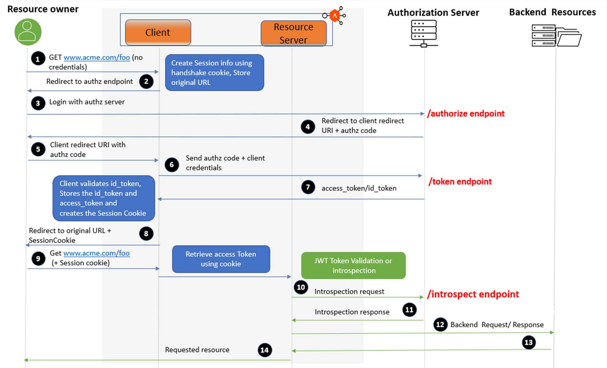

# HashiCorp Nomad <=> Vault Integration: Workload Identity (HIGH LEVEL)

## Background
[](https://www.hashicorp.com/blog/nomad-1-7-improves-vault-and-consul-integrations-adds-numa-support)

This example set is based on the following:
- https://gist.github.com/sofixa/17b9a5060851dc1dd95df3426978427e
- https://developer.hashicorp.com/nomad/tutorials/integrate-vault/vault-acl
- https://developer.hashicorp.com/nomad/tutorials/single-sign-on/sso-oidc-vault

This lab excercise will make use of Nomad Server and Client via local machine binaries and Vault in Docker (there will be some Docker Networking foibles to consider)

## Prerequisites

- Nomad *`1.7x+`*
  - Nomad ACL Bootstrap Token
- Vault *`1.12+`*
  - `VAULT_ADDR`
  - `VAULT_TOKEN`
  - Token/Auth with appropriate policy to CRUD auth and secrets backends
- Docker
- [pem-jwk](https://www.npmjs.com/package/pem-jwk) (`npm install -g pem-jwk`), manually utilize [jwt.io](https://jwt.io/), or similar tools
- curl
- jq
- npm
- make

## Options
- **JWKS Public Key**: If Nomad OIDC URL is not reachable by Vault or if you would like to trust multiple Nomad Clusters in the same Vault Auth Method / Backend, utilizing the JWKS Public Key is a viable method for these use cases. For more details, reference links and information [**>>HERE<<**](#vault-jwks-public-key-method-for-oidc--jwt-auth)
- **>> [JWKS and OIDC Discovery URLs](https://developer.hashicorp.com/vault/docs/auth/jwt#jwt-verification) <<**: Will be utilizing this method in the excercise.

## Network Connctivity
HashiCorp Vault and OIDC Endpoint for Nomad Client and Server must be reachable to each other.

##### E.g. [OIDC Connect Protocol](https://openid.net/specs/openid-connect-core-1_0.html#Overview)

The OpenID Connect protocol, in abstract, follows the following steps.

1. The RP (Client) sends a request to the OpenID Provider (OP).
2. The OP authenticates the End-User and obtains authorization.
3. The OP responds with an ID Token and usually an Access Token.
4. The RP can send a request with the Access Token to the UserInfo Endpoint.
5. The UserInfo Endpoint returns Claims about the End-User.

These steps are illustrated in the following diagram:

```shell
+--------+                                   +--------+
|        |                                   |        |
|        |---------(1) AuthN Request-------->|        |
|        |                                   |        |
|        |  +--------+                       |        |
|        |  |        |                       |        |
|        |  |  End-  |<--(2) AuthN & AuthZ-->|        |
|        |  |  User  |                       |        |
|   RP   |  |        |                       |   OP   |
|        |  +--------+                       |        |
|        |                                   |        |
|        |<--------(3) AuthN Response--------|        |
|        |                                   |        |
|        |---------(4) UserInfo Request----->|        |
|        |                                   |        |
|        |<--------(5) UserInfo Response-----|        |
|        |                                   |        |
+--------+                                   +--------+
```

##### E.g. Client - Server - Auth Flow

[](https://avinetworks.com/docs/latest/client-and-resource-server-for-oauth-oidc/)
Diagram Credit: [AVI Networks](https://avinetworks.com/docs/latest/client-and-resource-server-for-oauth-oidc/)

## High Level Steps

- Set Up Vault
  - Create a Policy for Nomad in Vault
  - Enable the JWT Auth Method
  - Configure Vault to use Nomad’s Public keys - either passing in the keys, a JWKS URL, or an OIDC Config URL
  - Create a Vault Role for Nomad
- Set up Nomad
  - Pass a Vault URL into Nomad Server config in a new configuration block (or v2 of the existing vault block). (Note: no token needed)
- Deploy Job
  - Job is configured to use new Vault integration
  - Nomad, recognizing that the new integration is being used, automatically requests a token for this job using the JWT auth method.

## Detailed Steps

Reference **[README >>HERE<<](./README.detailed.md)**


## APPENDIX

#### Reference: Vault Integration
- https://developer.hashicorp.com/nomad/docs/integrations/vault-integration
- https://developer.hashicorp.com/nomad/tutorials/integrate-vault
- https://developer.hashicorp.com/nomad/docs/concepts/workload-identity
- https://developer.hashicorp.com/vault/api-docs/auth/jwt#jwks_url
- https://www.hashicorp.com/blog/nomad-1-7-improves-vault-and-consul-integrations-adds-numa-support
- https://developer.hashicorp.com/nomad/tutorials/integrate-vault/vault-acl
- https://developer.hashicorp.com/nomad/docs/job-specification/vault
- https://developer.hashicorp.com/nomad/api-docs/operator/keyring#oidc-discovery


#### Nomad OIDC Endpoint
- https://developer.hashicorp.com/nomad/docs/configuration/server#oidc_issuer
- Sample Config Server Block:
  ```hcl
  server {
  enabled          = true
  bootstrap_expect = 3
  server_join {
    retry_join     = [ "1.1.1.1", "2.2.2.2" ]
    retry_max      = 3
    retry_interval = "15s"
    }
  }
  ```

#### Reference: OIDC
- https://developers.onelogin.com/openid-connect
- https://avinetworks.com/docs/latest/client-and-resource-server-for-oauth-oidc/
- https://darutk.medium.com/diagrams-of-all-the-openid-connect-flows-6968e3990660
- https://developer.okta.com/docs/concepts/oauth-openid/#authorization-code-flow-with-pkce
- https://developer.okta.com/blog/2019/10/21/illustrated-guide-to-oauth-and-oidc  
- https://openid.net/specs/openid-connect-basic-1_0.html
- https://openid.net/specs/openid-connect-core-1_0.html#Overview
- https://medium.com/@PaskSoftware/openid-connect-flows-73e785f74b55

#### Vault JWKS Public Key Method for OIDC / JWT Auth
  - https://support.hashicorp.com/hc/en-us/articles/12406076771347-Vault-JWT-auth-with-static-keys
  - https://developer.hashicorp.com/vault/docs/auth/jwt#jwt-verification
  - In the OIDC/JWT Auth configuration, an optional field called[`jwt_validation_pubkeys`](https://developer.hashicorp.com/vault/api-docs/auth/jwt#jwt_validation_pubkeys) that can be used to populate Public Keys for this option.
  - [`./jwks/01-04-nomad-jwks-jarvest.sh`](./jwks/01-04-nomad-jwks-harvest.sh) is an example on how to process the JWKS into a PEM format public key to add to your JWKS Public Key OIDC/JWT Auth configuration. [`pem-jwk`](https://www.npmjs.com/package/pem-jwk) is leveraged here.


#### Nomad Server Start with Config
- https://developer.hashicorp.com/nomad/docs/configuration#load-order-and-merging
- [Example](https://medium.com/hashicorp-engineering/hashicorp-nomad-from-zero-to-wow-1615345aa539):
  ```shell
  $ nomad agent -dev -config /path/to/my/config.hcl

  $ nomad agent -dev -config=<( echo 'client {options = {"driver.blacklist" = "java"}}' )
  ```

